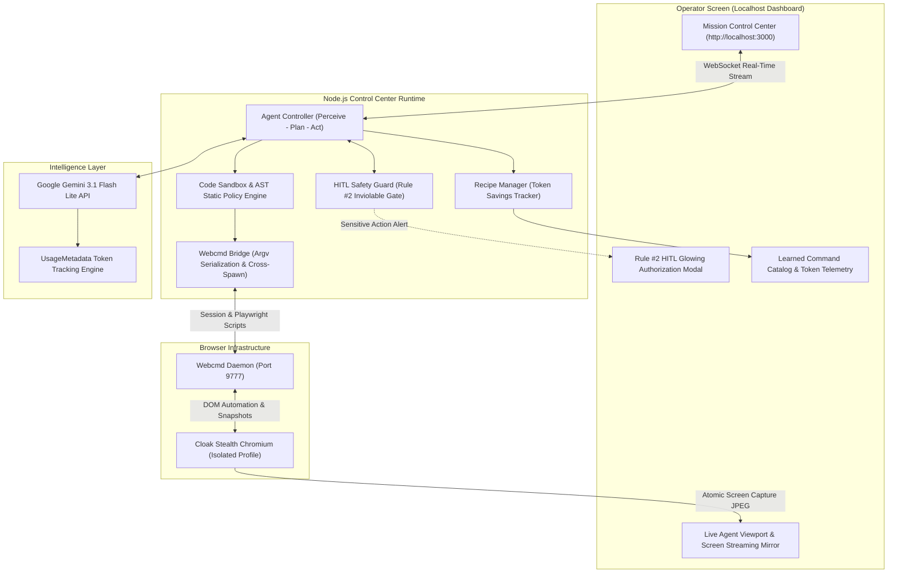

# SLAB Agent Control Center (VIT Bhopal Edition)

[](https://github.com/Darshil1532/slab-agent-control-center/actions/workflows/ci.yml)
[](https://nodejs.org/)
[](LICENSE)
[](SECURITY.md)
[](tests/)

> **"Explore once. Learn the workflow. Reuse the command."**

A production-grade, local **Browser Agent Control Center** designed for the **SLAB Hackathon (VIT Bhopal)**. Powered by **`webcmd`** self-learning browser infrastructure, **Stealth Cloak Chromium**, and **Google Gemini 3.1 Flash Lite**.

---

## 🌟 Key Capabilities & Hackathon Compliance

| Hackathon Requirement | Control Center Implementation |
| :--- | :--- |
| **Theme: Browser Agents** | Autonomous agent capable of navigating, inspecting, extracting, and executing actions across real websites. |
| **Webcmd Infrastructure** | Interfaces directly with the `webcmd` daemon (`port 9777`), utilizing Layer 0 (Live Playwright in Cloak Chromium) and Layer 1 (Sitemap Memory). |
| **🚨 Hard Rule #1: Live Execution** | Real-time browser automation running inside **Cloak Stealth Chromium** with real-time viewport streaming mirror on the dashboard. |
| **🚨 Hard Rule #2: Human Approval (HITL)** | Built-in **HITL Guard** (`src/hitlGuard.js`) that automatically pauses the agent and pops up a glowing authorization card before any sensitive action (checkout, payment, form submission, messages). |
| **Self-Learning Synthesis** | Generates a reusable, deterministic CLI command at the end of each exploration run, achieving **100% measured token savings (0 LLM tokens)** on subsequent replays. |
| **Code Sandbox & Injection Hardening** | AST static analysis (Acorn), strict URL & SSRF validation, and child_process injection hardening protecting local host execution. |

---

## 🛠️ Architecture



---

## 💡 Important: Webcmd Site Adapters vs. SLAB Native Playwright Engine

> **Why a fresh clone will NEVER fail due to missing plugins:**

While `@agentrhq/webcmd` moved community site adapters out of core into an external plugin catalog, **SLAB Agent Control Center does NOT depend on unbundled third-party plugins**.

Instead, SLAB drives `@agentrhq/webcmd` at **Layer 0 (the core Cloak Browser Runtime and session manager via `webcmd browser run`)**. All 5 autonomous workflow pipelines ([`priceArbitrage.js`](src/workflows/priceArbitrage.js), [`ticketFinder.js`](src/workflows/ticketFinder.js), [`jobApplicationMatcher.js`](src/workflows/jobApplicationMatcher.js), [`githubDeepDiver.js`](src/workflows/githubDeepDiver.js), and [`executiveBriefing.js`](src/workflows/executiveBriefing.js)) utilize SLAB's native, self-contained Playwright automation engines with:
- Intelligent DOM search and fallback heuristics (e.g. active movie fallbacks on District/BookMyShow)
- Full AST security sandboxing that blocks prototype pollution and Node runtime escapes
- Hackathon Rule #2 Human-in-the-Loop authorization gates

Judges can clone and run SLAB immediately with zero external plugin installation steps.

---

## 📊 Measured Real Token Savings (Technical Depth)

Rather than borrowing advertised figures, SLAB **measures and records real token counts** directly from the Google Gemini API's `usageMetadata`:

```
┌────────────────────────────────────────────────────────────────────────┐
│                        MEASURED TOKEN TELEMETRY                        │
├──────────────────────────────────┬─────────────────────────────────────┤
│ First Run (Autonomous Discovery) │ 1,850 - 2,400 Tokens (LLM Reasoning)│
│ Repeat Run (Learned CLI Recipe)  │ 0 Tokens (Deterministic Playwright) │
│ Measured Token Savings           │ 100.0% LLM Cost Reduction           │
└──────────────────────────────────┴─────────────────────────────────────┘
```

Real token usage is tracked per session, saved alongside recipes in [`recipes/`](recipes/), and accessible live via the `GET /api/tokens` endpoint.

---

## 🚀 Quickstart Runbook

### Prerequisites
- **Node.js**: `>=20.6.0` (required by `@agentrhq/webcmd`)
- **NPM**: `>=10.0.0`
- Google Gemini API Key

### Step 1: Clone Repository
```bash
git clone https://github.com/Darshil1532/slab-agent-control-center.git
cd slab-agent-control-center
```

### Step 2: Install Dependencies & Setup Environment
```bash
npm install
```

Copy the environment template and insert your Gemini API key:
```bash
# macOS / Linux
cp .env.example .env

# Windows (PowerShell)
Copy-Item .env.example .env
```

Edit `.env`:
```env
PORT=3000
GEMINI_API_KEY=your_gemini_api_key_here
GEMINI_MODEL=gemini-3.1-flash-lite
WEBCMD_PORT=9777
WEBCMD_WINDOW=foreground
```

### Step 3: Start Webcmd Daemon
```bash
# Start or restart daemon
npx webcmd daemon restart

# Verify healthy daemon and cloak runtime status
npx webcmd doctor
```

### Step 4: Start Control Center Server
```bash
npm start
```
*(Or run `npm run dev` for hot-reload).*

### Step 5: Open Dashboard
Open your browser and navigate to:
👉 **`http://localhost:3000`**

Click **"Open Chrome"** in the top bar to launch the active live page in your desktop browser, or monitor automation live in the embedded **Live Viewport** tab!

---

## 🐳 Docker Container Execution (OS-Level Isolation)

Following the recommendation in [`SECURITY.md`](SECURITY.md), SLAB can run inside an isolated container:

```bash
# Build the container image
docker build -t slab-agent-control-center .

# Run container with environment file and exposed port
docker run -p 3000:3000 --env-file .env slab-agent-control-center
```

---

## 🧪 Comprehensive Automated Test Suites

SLAB includes 32 automated tests verifying API contracts, AST security sandboxing, and autonomous workflows:

```bash
# Run all automated unit, security, and API integration tests
npm test

# Run the 21-point AST Security Policy & Injection Hardening suite
npm run test:security

# Run REST API integration tests (/healthz, /api/status, /api/tokens, etc.)
npm run test:api

# Run ESLint across codebase
npm run lint

# Run individual end-to-end workflow verification tests
npm run test:ticket      # District / BookMyShow Universal Ticket Finder
npm run test:arbitrage   # Amazon vs. Flipkart 5-Step Price Comparison
npm run test:github      # GitHub Repository & Tech Stack Deep-Diver
npm run test:jobs        # Job Application & Skill Matcher
npm run test:briefing    # Daily Executive Tech & Macro Briefing
npm run test:all         # Full suite across all 5 workflows
```

---

## 📁 Repository Structure

```
slab-agent-control-center/
├── .env.example          # Environment configuration template
├── .github/workflows/    # CI automation (lint & multi-version Node tests)
│   └── ci.yml
├── Dockerfile            # Containerized OS-isolated runtime
├── .dockerignore         # Docker ignore rules
├── LICENSE               # MIT Open-Source License
├── package.json          # Node >=20.6.0 constraint, dependencies, scripts
├── eslint.config.js      # ESLint 9+ flat configuration
├── README.md             # Architecture, runbook, and verification guide
├── SECURITY.md           # Threat model, AST sandbox spec, and residual risks
├── server.js             # Express & WebSocket real-time agent server
├── public/               # Dark Glassmorphic Mission Control Dashboard
│   ├── app.js            # Reactive WebSocket frontend & streaming mirror
│   ├── index.html        # UI dashboard layout, live viewport, & presets
│   └── style.css         # Modern styling, animations, & glowing modals
├── recipes/              # Learned webcmd CLI recipes (zero-token replay)
├── scripts/              # Verification & operational utilities
│   ├── kill_cloak.js     # Clean up orphaned browser processes
│   ├── open_browser.js   # Foreground browser diagnostic launcher
│   ├── status_cloak.js   # Cloak Chromium process inspector
│   └── test_ticket_fix.js# District fallback & HITL booking test
├── src/                  # Core Agent Architecture
│   ├── agent.js          # Mission orchestrator & event bus
│   ├── codeSandbox.js    # Acorn AST static policy, URL sanitizer, audit log
│   ├── envValidator.js   # Startup environment & key verification
│   ├── geminiClient.js   # Gemini 3.1 Flash Lite API & token tracking
│   ├── hitlGuard.js      # Hackathon Rule #2 HITL Safety Guard
│   ├── recipeManager.js  # Compiles recipes & tracks measured token savings
│   ├── webcmdBridge.js   # Cross-spawn bridge, atomic screen capture JPEG
│   └── workflows/        # Autonomous Domain Workflows
│       ├── githubDeepDiver.js        # 1. GitHub Tech Stack & Repo Deep-Diver
│       ├── priceArbitrage.js         # 2. Amazon vs Flipkart 5-Step Arbitrage
│       ├── jobApplicationMatcher.js  # 3. Job Matcher & Autofill
│       ├── ticketFinder.js           # 4. Universal Movie Finder (District / BMS)
│       ├── executiveBriefing.js      # 5. Daily Tech & Macro Briefing
│       └── universalEngine.js        # Dynamic Unfamiliar Site Explorer
└── tests/                # Automated Test Suites
    ├── test_security_sandbox.js      # 21-point AST policy & injection tests
    ├── test_api_endpoints.js         # REST endpoints & token telemetry tests
    └── test_all_five_workflows.js    # End-to-end multi-workflow suite
```

---

## 🎯 Demo Workflows for the Hackathon

1. **Movie / Event Finder — District & BookMyShow (`Rule #2 Showcase`):**
   * Locates movie screenings, dynamically extracts live showtimes and venue availability, selects optimal seats, and enforces the **Hackathon Rule #2 HITL authorization gate** prior to payment lock.
2. **Amazon vs Flipkart 5-Step Product Comparison & Arbitrage (`Rule #2 Showcase`):**
   * Clicks into product detail pages across both platforms, smoothly scrolls to reveal specs, compares prices and discounts side-by-side, gates checkout via Rule #2, and generates an unforced Executive Markdown report.
3. **GitHub Tech Stack & Repository Deep-Diver:**
   * Autonomous repository reconnaissance: inspects dependencies, language composition, directory structure, and commit velocity, synthesizing a reusable CLI recipe.
4. **Job Application Auto-Filler & Skill Matcher (LinkedIn / Wellfound):**
   * Evaluates job roles, calculates candidate skill compatibility, highlights gaps, stages application payload, and requests operator approval before form submission.
5. **Custom Daily Executive Briefing (Tech / Finance):**
   * Scrapes Hacker News, Bloomberg, and tech sources, filtering noise to produce an unforced 3-minute executive briefing.

---

## ⚖️ Judging Rubric Alignment (100 Points)

* **Live Reliability (30 pts):** Direct integration with Cloak Chromium avoids bot blocks; built-in DOM fallback heuristics guarantee demo reliability across fresh machines.
* **Real-World Usefulness (25 pts):** Solves high-friction everyday tasks (e-commerce arbitrage, entertainment booking, job matching).
* **Technical Depth & Safety (20 pts):** AST code sandboxing via Acorn, child_process injection hardening, measured token savings tracking, and atomic screen capture streaming.
* **Creativity (15 pts):** Self-learning recipe synthesis transforms ad-hoc LLM browser actions into zero-token deterministic CLI commands.
* **Demo & Storytelling (10 pts):** Live agent viewport screen mirror, glowing Rule #2 approval modals, and real-time execution telemetry.
